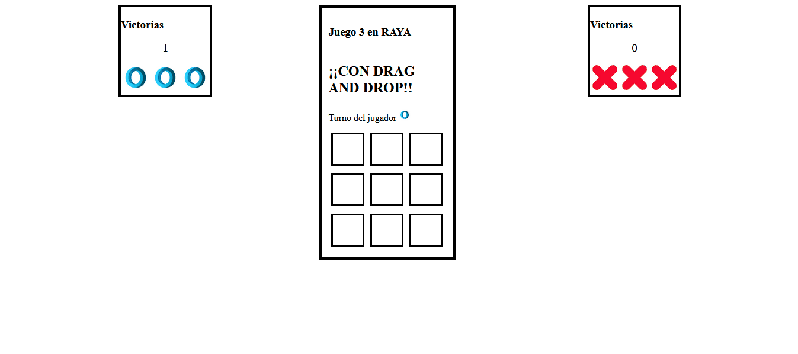

# 🎮 Juego Tres en Línea

Este proyecto es un juego de "Tres en Línea" que se puede jugar en el navegador, desarrollado con JavaScript, HTML y CSS. Los jugadores pueden arrastrar y soltar fichas, y el sistema gestiona los turnos, muestra el marcador y detecta las combinaciones ganadoras.

## ✨ Funcionalidades

- 🕹️ **Gestión de Turnos**: Indica visualmente qué jugador tiene el turno.
- 🎲 **Drag and Drop**: Los jugadores pueden arrastrar y soltar sus fichas en las casillas del tablero.
- 🏆 **Comprobación de Ganador**: Detecta automáticamente combinaciones ganadoras en el tablero.
- 📊 **Marcador**: Lleva un registro de las victorias de cada jugador.
- 🔄 **Reinicio Automático**: El juego reinicia el tablero al final de cada ronda.
- 💬 **Mensajes de Estado**: Muestra mensajes de error si se intenta ocupar una casilla llena o si el jugador no tiene el turno.

## 🔧 Estructura del Código

### 🌍 Variables Globales

- `turnoJugador`: Almacena el turno del jugador actual (`"A"` o `"B"`).
- `victoriasA` y `victoriasB`: Contadores de victorias de cada jugador.

### ⚙️ Funciones Principales

1. **inicializarTurno()** 🎉
   - Inicializa el turno mostrando el jugador que empieza y su imagen en pantalla.

2. **allowDrop(e)** 🚧
   - Permite soltar fichas en las casillas al arrastrarlas.

3. **drag(e)** 📦
   - Gestiona el evento de arrastre. Solo permite mover fichas pertenecientes al jugador del turno actual.

4. **drop(e)** 🗂️
   - Maneja el evento de soltar la ficha en una casilla. Verifica si la casilla está vacía y alterna el turno entre jugadores.

5. **comprobar()** ✅
   - Verifica si existe una combinación ganadora de tres fichas en línea.

6. **ganar(ficha1)** 🏅
   - Declara al ganador de la ronda, actualiza el marcador y muestra un mensaje de victoria.

7. **resetJuego()** 🔄
   - Restablece el tablero al estado inicial y coloca las fichas de cada jugador en sus posiciones originales.

8. **actualizarMarcador()** 🧮
   - Muestra el marcador actualizado en pantalla.

9. **comenzar()** 🚀
   - Inicializa el juego al cargar la página, reiniciando los contadores y el turno.

10. **mostrarMensaje(texto, duracion)** 💬
    - Muestra un mensaje emergente temporal en una ventana pequeña.

## 📄 Instrucciones de Uso

1. Clona el repositorio o descarga el código.
2. Abre el archivo `index.html` en un navegador.
3. Al cargar la página, el jugador A comienza con el turno.
4. Arrastra una ficha del área del jugador al tablero.
5. Suelta la ficha en una casilla vacía. El turno cambiará automáticamente.
6. El primer jugador que logre tres en línea gana la ronda, y su contador de victorias se actualizará.
7. El juego se reinicia automáticamente después de declarar un ganador.

## 📂 Estructura de Archivos

- **index.html** 📄: Estructura del tablero y áreas de fichas de cada jugador.
- **style.css** 🎨: Estilos para el tablero, áreas de jugadores y mensajes.
- **js.js** 🚀: Lógica del juego y funciones principales (drag and drop, turnos, detección de ganadores, etc.).
- **img/o.jpg** y **img/x.jpg** 🖼️: Imágenes de fichas para los jugadores A y B.

## 💻 Tecnologías

- HTML 🧱
- CSS 🎨
- JavaScript 📜

## 🚀 Mejoras Futuras

- 💫 Agregar efectos de animación al arrastrar y soltar fichas.
- 🔢 Implementar una opción para resetear el marcador de ambos jugadores.
- 🤖 Posibilidad de jugar contra una inteligencia artificial.

## 🙌 Créditos

Desarrollado por Brian, Ivan y Ana.
